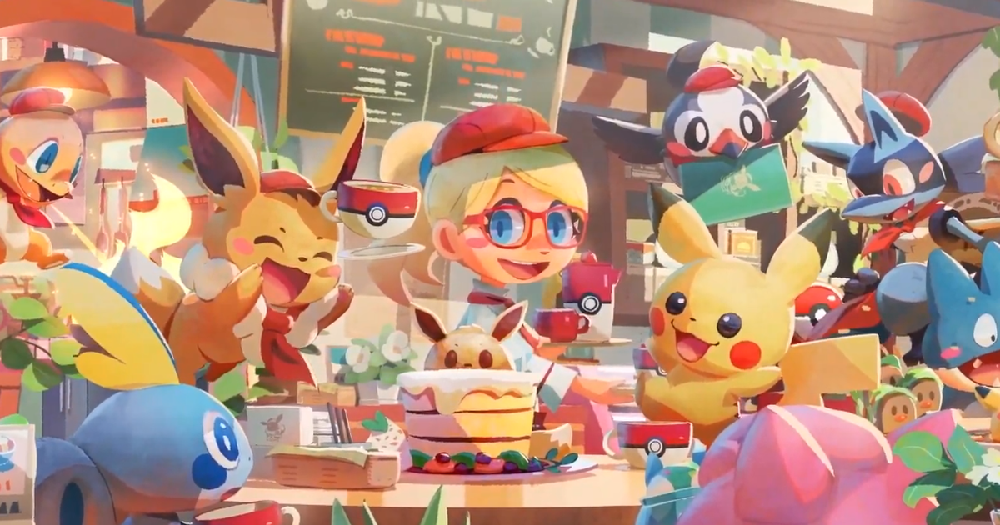

# Projeto Integrador - Modelo

Um modelo para o desenvolvimento do Projeto Integrador do Curso de Técnico em Desenvolvimento de Sistemas para a Internet Integrado ao Ensino Médio do IFC - Campus Araquari.

Professores: [Marco André Mendes](github.com/marcoandre) e [Alann Perini](https://github.com/AlannKPerini).

Links do projeto:

-   [Documentação (esse documento)](github.com/marcoandre/pi-modelo)
-   [Backend](github.com/marcoandre/pi-backend)
-   [Frontend](github.com/marcoandre/pi-frontend)

# Padaria e Confeitaria Wonder Bakery

- A Wonder Bakery é uma padaria e confeitaria temática do universo de Pokemon, ela tem seu foco em deixar suas receitas únicas e atrativas prezando não só o sabor mas também a apresentação. Ela existe desde 2013 e vem se aperfeiçoando até hoje, seu dono é Satoshi Tajiri e possui 9 funcionários, 4 Padeiros, 2 caixas, 3 atendentes e 3 entregadores.

- Atualmente a padaria funciona de forma presencial, seus pedidos podem ser feitos no  caixa ou por meio de algum atendente no local, mas recentemente isso se tornou um problema pois mesmo as vendas estando ótimas eles se sentem limitados em questão de área de vendas.
- Recentemente a equipe sentiu a necessidade de uma plataforma para vendas online visando ampliar suas vendas juntamente com a criação de filiais. Para isso requisitou um site que possibilitasse aos clientes fazerem pedidos de produtos da padaria por meio de um carrinho e então recebessem em suas casas o pedido por meio dos entregadores
- Também foi pontuado a importância do endereço do cliente e o interesse em facilitar o trabalho do cliente de alguma forma na hora da compra.
- Foi pedido que o site tivesse grande destaque na aparência dos confeitos pois essa é uma importante parte do negócio, solicitando que ficassem à vista e com “imagens grandes”.

- Foi notado que eles precisam de uma plataforma simples para vendas online, com necessidade da criação de um cadastro para facilitar na hora da compra, permitindo registrar seus meios de pagamento, endereço, seu nome e um código para receber a entrega. Tendo um front end amigável passando a imagem da Wonder.

# Descrição da proposta

* Visamos fazer um sistema simples para quem maneja e atrativo para quem usa, priorizando a parte visual. Seguiremos com um sistema de cadastro para registrar dados do usuário como endereço, formas de pagamento, etc. O sistema será focado nas vendas e por isso precisará transmitir os pedidos para os confeiteiros após serem finalizados, também faremos um sistema de pesquisa para facilitar a busca pelos produtos e um para marcar os que estão indisponíveis e registrar promoções e cupons. 

# Regras de Negócio 

- **RN01** – *Criação Comanda:* Para iniciar um atendimento no balcão, é necessário primeiro abrir uma nova comanda.

- **RN02** – *Inserir Produtos Comanda:* Para inserir um produto na comanda, é necessário que o produto esteja cadastrado no sistema e que a quantia comprada seja acima de zero.
- **RN03** – *Relatório de Fluxo de Caixa:* O relatório de fluxo de caixa será permitido somente para o administrador, fornecendo data, hora e produtos comprados.
- **RN04** – *Estoque:* O Sistema deve manter a entrada e saída de itens do estoque com data e quantidade registrando um relatório de fluxo para o administrador.
- **RN05** – *Produtos:* O sistema deve manter o registro dos produtos em estoque.
- **RN06** – *Compra:* O sistema deve registrar cada venda efetuada 

# Requisito Funcional

**ENTRADA**
- **R.F.01 - Registro de Usuário:** O sistema deve manter os usuários registrados e seus devidos níveis após o primeiro cadastro deles, usando seu nome de usuário e senha.
Dados necessários:
Nível de Usuário:

- **R.F.02 - Venda de Produtos:** Todos os produtos vendidos devem estar devidamente registrados no estoque.
Dados necessários:
Nível de Usuário:

- **R.F.03 - Calculo de Vendas:** O sistema deve calcular o valor dos itens adicionados pelo usuário na venda.
Dados necessários:
Nível de Usuário:

**PROCESSOS**
- **R.F.04 - Autentificação de Usuário:** O sistema deve ser capaz de autentificar o usuário que o está acessando com base no Registro de Usuário para checar seu nível e sua autenticidade.
Dados necessários:
Nível de Usuário:

- **R.F.05 - Reposição:** Se os produtos do estoque estiverem em baixa quantidade (20) deve ser enviado um aviso de reposição pelo sistema.
Dados necessários:
Nível de Usuário:

- **R.F.06 - Gerenciamento de Venda:** Toda compra feita no caixa deve emitir uma nota e só poderá ser efetuada mediante a confirmação do pagamento.
Dados necessários:
Nível de Usuário:

**SAÍDA**
- **R.F.07 - PlaceHolder:** aaaaa 
Dados necessários:
Nível de Usuário:

- **R.F.08 - PlaceHOlder:** aaaaa 
Dados necessários:
Nível de Usuário:

# Requisitos Não Funcionais

- **N.F.R.01 - Manutenção:** O sistema deve receber uma manutenção sempre que necessário.

- **N.F.R.02 - Portabilidade:** O sistema deve ser capaz de rodar nos navegadores Chrome, Opera e Microsoft Edge.

- **N.F.R.03 - Compatibilidade:** O sistema deve ser compativel com Linux e Windowns.

- **N.F.R.04 - Banco de Dados:** O banco de dados do sistema deverá ser feito em MySQL ou PostgresSQL.

- **N.F.R.05 - Atuação:** O sistema deve ser capaz de lidar com ao menos 10 usuários simultaneos.

- **N.F.R.06 - Conexão:** O sistema não deve necessitar de conexão com a Internet.

- **N.F.R.07 - Segurança:** O sistema deve possuir uma forma de autentificar o usuário.

- **N.F.R.08 - Disponibilidade:** O sistema deve funcionar durante o periodo de funcionamento da padaria.
